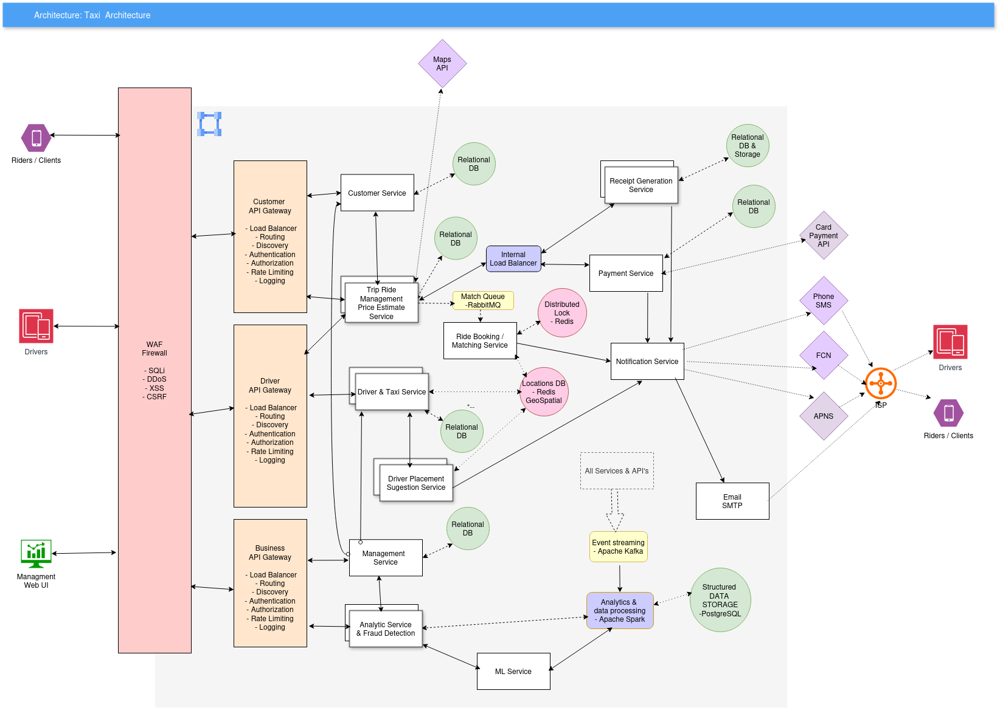
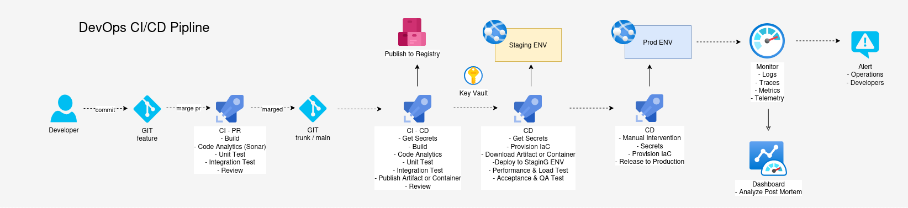

# Systems Design Intervew

Systems Design Interview For IT Taxi App like Uber or Cabify

Design a scalable system architecture in the cloud for global taxis business around the world in major cities of the world, in total its more than 11.000 cars worldwide. Our taxis are operating every day 24 hours and complete small or large trips throughout the day. 

From our headquarters we have to ensure many things in order to run the business,
1. We have to ensure receipts are generated for every trip
2. Our management can review various metrics from the trips 
    1. revenue per city
    2. length of the trips
    3. Other
3. We should be able to prevent fraud
4. Plan where we place our taxis within the city throughout the day.


## 1. Architecture: 

Design an achitecture that allows us to collect, process and analyze data from our taxi operation as well as send data back to individual cars and communicate with our users. 



[Architecture Diagram Image](images/architecture.png)

[Diagram drawio](images/diagram.drawio)


## 2. Automation 
Develop script to automate the setup and maintenance of your architecture. Its ok if its only parts of it or 2-3 components and not the whole architecture.  We should be able: to rollout the components or microservices and also update the whole or the individual parts of it. 



[Pipline Diagram Image](images/pipline.png)

[Demo Pipline](pipline/azure-pipelines.yml)


### Example APP
Python REST Web APP for Analytics Service
TODO: 
- Autentication & [Authorisation](https://www.freecodecamp.org/news/build-secure-apis-with-flask-and-auth0/) with [auth0](https://developer.auth0.com/resources/code-samples/api/flask)
- Replace moc data with persistance data in SQL or Redis
- [Deploy to Azure](https://learn.microsoft.com/en-us/azure/app-service/tutorial-python-postgresql-app-flask?tabs=copilot&pivots=azure-portal)
- Add Test for all API end points and methods (TDD)

API Endpoints:

GET /analytics/city/{city-id} 
    - city-id: es-mad
    - url params....
```json
{
    "query_details": {
      "city_id": "es-mad", 
      "start_date": "2025-03-29",
      "end_date": "2025-03-29",
      "granularity": "daily",
      "generated_at": "2025-03-30T16:42:55Z" 
    },
    "metrics_summary": { 
      "city_id": "es-mad", 
      "city_name": "Madrid",
      "total_revenue": {
        "amount": 48700.50,
        "currency": "EUR"
      },
      "completed_trips": 2510,
      "average_trip_distance_km": 8.5,
      "total_trip_distance_km": 21335,
      "average_trip_duration_minutes": 22.1,
      "total_trip_duration_hours": 924.8,
      "average_fare_per_trip": {
        "amount": 19.40,
        "currency": "EUR"
      },
      "unique_active_drivers": 650,
      "unique_active_riders": 2250,
      "rider_cancellation_rate_percent": 5.5,
      "driver_cancellation_rate_percent": 2.0
    }
}
```

GET /analytics/trip/{trip-id}
```json
{
    "trip_id": "a1b2c3d4-e5f6-7890-1234-567890abcdef",
    "rider": {
      "rider_id": "f0e9d8c7-b6a5-4321-fedc-ba9876543210",
      "first_name": "Elena",
      "last_name": "García"
    },
    "driver": {
      "driver_id": "1a2b3c4d-5e6f-7890-abcd-ef1234567890",
      "first_name": "Javier",
      "last_name": "Martínez",
      "average_rating": 4.85
    },
    "vehicle": {
      "vehicle_id": "fedcba98-7654-3210-1a2b-3c4d5e6f7890",
      "make": "Seat",
      "model": "León",
      "color": "Rojo",
      "license_plate": "1234 ABC",
      "vehicle_type": "standard"
    },
    "trip_status": "completed",
    "request_time": "2025-03-30T15:10:15Z",
    "accept_time": "2025-03-30T15:11:05Z",
    "pickup_time": "2025-03-30T15:15:45Z",
    "dropoff_time": "2025-03-30T15:35:10Z",
    "estimated_pickup_time": "2025-03-30T15:16:00Z",
    "estimated_dropoff_time": "2025-03-30T15:38:00Z",
    "estimated_fare": 18.50,
    "actual_fare": 19.75,
    "fare_currency": "EUR",
    "fare_breakdown": {
      "base_fare": 3.50,
      "distance_charge": 9.80,
      "time_charge": 4.20,
      "surge_multiplier": 1.0,
      "tolls": 0.00,
      "booking_fee": 1.00,
      "tax_vat": 1.25
    },
    "distance_meters": 7850,
    "duration_seconds": 1165,
    "pickup_location": {
      "address": "Calle de Serrano, 45, 28001 Madrid, Spain",
      "latitude": 40.4288,
      "longitude": -3.6885,
      "city": "Madrid"
    },
    "dropoff_location": {
      "address": "Plaza Mayor, 1, 28012 Madrid, Spain",
      "latitude": 40.4154,
      "longitude": -3.7074,
      "city": "Madrid"
    },
    "map_polyline": "encoded_polyline_string_here...", 
    "payment_method_details": 
    { 
        "payment_method_id": "pm_abc123xyz...",
        "card_type": "Visa",
        "last4": "4242"
    },
    "created_at": "2025-03-30T15:10:15Z",
    "updated_at": "2025-03-30T15:35:15Z"
}
```


## 3. Data Exfiltration and Infiltration: 
Think about how to secure the data we are collecting for this use case and the platform in general. What tools and approaches can be used to minimize the risk of unwanted Data Exfiltration or Data Infiltration that is stored in the cloud.

### Data Exfiltration (out) & Data Infiltration (in)

1. Access Control & Authentication:
Strong MFA Authentication, Role-Based Access Control (RBAC) with Principle of Least Privilege.
    - Cloud IAM, Cloud Identity, Secret Manager, Key Management Service

2. Encryption:
Encrypt data both at rest (stored data) and in transit (data being transmitted), Implement secure key management practices
    - Hashes, Transparent Data Encryption (TDE), HTTPS, which utilizes SSL/TLS encryption, ACE, 

3. Network Segmentation:
Segregate Networks, Firewalls and Intrusion Detection/Prevention Systems (IDS/IPS)
    - Virtual Private Cloud (VPC), VPC Firewall Rules, Load Balancing, CDN, Cloud IDS, Cloud Armor

4. Data Loss Prevention (DLP):
Implement DLP solutions that monitor and control data movement, Develop and enforce DLP policies.
    - Cloud Data Loss Prevention (DLP) API

5. Endpoint Security:
Endpoint Detection and Response (EDR),Regular Updates and Patching
    - Microsoft Intune, Microsoft Defender, force updates in the iOS & Android

6. Security Awareness Training for employees
7. Monitoring and Incident Response
8. Regular Security Audits and Penetration Testing


## 4. Vision: 
Create a vision for the future of our taxi company data platform, what are going to be important pillars and elements that we should focus on in the next 2-3 years.

### We should focuse on: 
- Have clear defined KPI, SLA with SLO & SLI to measure and improve business in key areas.
- Gaining new customers by providing great, fast, reliable and economicaly competitive taxi serice. 
- Retaining exisiting customers by increesing customer satisfaction and constantly improving the serice.
- Constantly simplifiyng the User interaction (UI/UX) to increese the satisfaction and ease of use. 
- Understanding the customer and regional needs by having a consisntent Data Lakehouse with Advanced Analytics & AI/ML that will be able:
    - Real time Demand Forecasting 
    - Real time Dynamic Pricing
    - Customer Lifetime Value (CLV) & Churn Prediction
    - Sustainability Focus
- Introduce new Features souch as 
    - Ride Sharing to optimise cost for the clients
    - Real time translation in the Client / Driver Chat App
    - Subscriptions and special offers for recurrent users 


## Implicit Functional Requirments
### Core
- Riders should be able to create there account, verify the email and phone, add personal information, payment method, sing the contract, get verivied and more. 
- Drivers should be able to create there account, add personal information, taxi lisence sign contract, get verified and more. 
- Riders should be able get a fare estimate of the trip based on the input source location and a destination location.
- Riders should be able to request a ride based on the estimated fare. 
- Riders should be matched with a driver who is nearby and available upon request.
- Drivers should be able to accept/decline a request.
- Drivers should navigate to pickup/drop-off location.

## Functional Requirments 
### Core
- The system should store and generat a unique receipt for each completed trip.
- Business Managers should be able to view and analyse metrics from the trip souch as length of each trips and revenue per city.
- The system should perform fraud detection based on customers information and trip data to flagg it for manual review. 
- The system should perform suggestions of City areas where to be for Drivers based on there current location, real time data of other Drivers (suply) and Riders (demand). 

### Out of scope requirments 
- Riders and Drivers should be able to comunicate via chat or call once the ride is accepted.
- Riders should be able to rate their Rides and Drivers after the.
- Drivers should be able to rate Riders after the trip.
- Riders should be able to schedule rides in advance.
- Riders should be able to request different categories of cars.
- The system should be able to accept multiple payment methods and gateways, not only cash(visa, mastercard, amex, ....)
- Business Managers should be able to review and verify to aprove or deny every Drivers request.
- Business Managers should be able to block and restrict access to Riders and Drivers.
- The system shall allow management to view and act on flagg as fraud trips. 
- The system shall allow management to define and adjust fraud detection rules. 

## Non-Functional Requirments
### Core Requirements
- The system should ensure the security and privacy of user and driver data, complying with regulations in like GDPR in Europe.
- The system should facilitate easy setup, updates, maintenance and roll out of each service without significant downtime.
- The system shall ingest real-time data (GPS, trip status updates) from all 11,000+ taxis with with low latency especialy during peack hours.
- Mechanisms shall be in place to prevent accidental or intentional exfiltration (Data Loss Prevention) of sensitive data.
- The architecture shall be designed to scale verticaly and horizontally for all critical components or services to handle increasing data volume, user traffic, and the potential addition of more taxis.

### Out of scope
- The system should have Strict SLO and SLI for Performance, Availability, Security, Data Integrity, Maintainability, ...
- The system should be resilient to failures, with redundancy and failover mechanisms in place.
- The system should be able to handle high throughput, especially during peak hours or special events 
- The system shall be able to automatically scale resources up or down based on demand fluctuations.
- The data lake and data warehouse shall be capable of storing and efficiently querying large abount of data.
- The system should have robust monitoring, logging, and alerting to quickly identify and resolve issues.
   

## Core Entities or Services

### Rider or Customer Service
- Responsibilities: Manages user accounts (registration, login, profile), handles user preferences, payment methods, and trip history for users.
- Data Storage: Cloud SQL (PostgreSQL) for relational user data, potentially Memorystore (Redis) for caching user sessions and frequently accessed data.
- Google Cloud Deployment: Cloud Run or App Engine.

### Driver Service
- Responsibilities: Manages driver accounts (registration, verification, status - online/offline, availability), driver profiles, vehicle information, earnings, and trip history for drivers.
- Data Storage: Cloud SQL (PostgreSQL) for relational driver data, potentially Memorystore (Redis) for caching driver online status and location.
- Google Cloud Deployment: Cloud Run or App Engine.

### Management Service
- Responsibilities: This service handles manager-administrator concerns such as authentication, dirver validation, user managment.
- Data Storage: Cloud SQL (PostgreSQL) for relational driver data, potentially Memorystore (Redis) for caching driver online status and location.
- Google Cloud Deployment: Cloud Run or App Engine.

### Trip Ride Management & Pricing Fares Service
- Responsibilities: Manages the active trip lifecycle: tracking GPS coordinates, calculating fares, get pricing calculation, updating trip status, and triggering receipt generation upon completion.
- Data Storage: Cloud Bigtable is well-suited for storing high-volume, time-series GPS data. Cloud Spanner could be used for maintaining the current state of active trips requiring strong consistency.
- Google Cloud Deployment: Cloud Run.


### Ride Booking / Matching Service
- Responsibilities: Handles the core taxi booking process: receiving booking requests, matching users with available drivers based on location and other criteria, managing the booking lifecycle (pending, accepted, ongoing, completed, cancelled).
- Data Storage: Memorystore (Redis) with Geospatiol Indexing.
- Google Cloud Deployment: Cloud Run.

### Receipt Generation Service
- Responsibilities: Generates receipts for completed trips in various formats (e.g., PDF, email) and trigger Notification Service
- Data Storage: Cloud SQL (PostgreSQL). Could use Cloud Storage for storing generated receipts.
- Google Cloud Deployment: Cloud Run, an event-driven task triggered by trip completion.

### Taxi Placement Sugestion Service
- Responsibilities: Analyzes historical data and real-time demand predictions (from ML models) to suggest optimal locations for taxis throughout the day.
- Data Storage: Relies heavily on Locations Database on Redis GeoSpatial index.
- Google Cloud Deployment: Cloud Run.

### Payment Service
- Responsibilities: Handles payment processing for completed trips, integrates with payment gateways, manages payment methods, and processes refunds.
- Data Storage: Cloud SQL (PostgreSQL) for storing payment transaction details and potentially encrypted payment method information (following PCI DSS compliance).
- Google Cloud Deployment: Cloud Run, with a strong focus on security and potentially running in a dedicated, more restricted network.

### Notification Service
- Responsibilities: Sends real-time notifications to users (e.g., driver arrival, fare updates), drivers (e.g., new ride requests), and potentially management (e.g., alerts). Integrates with Apple APNS & Firebase Cloud Messaging (FCM).
- Data Storage: Primarily relies on data from other services to determine notification content and recipients. Could use Cloud Firestore (NoSQL) for storing notification preferences.
- Google Cloud Deployment: Cloud Run.

### Analytics Service & Fraud detection
- Responsibilities: Analyzes Data from all source, specialy trip data and user/driver behavior to identify and flag potentially fraudulent activities. Integrates with machine learning models.
- Data Storage: Relies on data from other services (Booking, Trip Management, User, Driver). Could store fraud rules and flagged incidents or Cloud Firestore.
- Google Cloud Deployment: Cloud Run.
